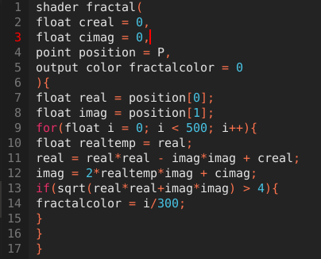
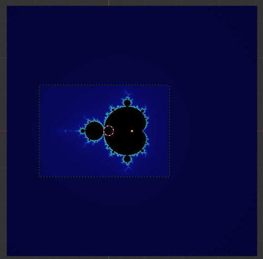
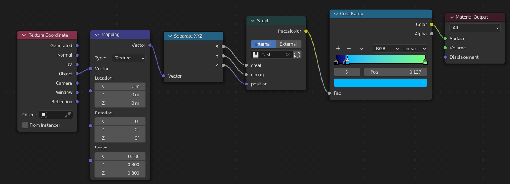

This first blogpost is about a really long journey with just one simple goal, to get a high resolution image of the mandelbrot set. You might think that this is an easy task, but it was quite hard actually. I've downloaded a lot fractal visualization programs, but they were all lacking in some way shape or form. It would also be nice if the colour of the mandelbrot set could be changed.

The first program that I started with was Xaos. It's a nice little program, it's fast, simple and you can also plug in your own formulas. The only problem with Xaos was that the resolution was a bit on the low side. Furthermore, the colours were a bit dull and harsh.

Next up is Ultra Fractal 6. Let's get to the point, I installed the program, pressed render image, and the next thing I saw was. EVALUATION COPY, dotted all over the image. The program looks really promising, but you are met with a paywall.

Another program I tried was QuickMAN. I really liked the name of this program, I'm guessing that it refers to Quick mandelbrot. The problem was, once again the resolution. Even at 5000x5000 pixels you could still see a lot of blocks and jagged edges all over the mandelbrot set.

After hours of trying, I took the matter into my own hands. I gave up searching, and went straight to Blender. I love this program, I also used it for the logo of this website. The gradient has been done outside of blender, but it could easily be done in blender. I looked up a tutorial on how to do the mandelbrot set in blender, and I found a video by CGmatter (link below). 'Create procedural fractals fast'. I clicked on it and boy it was fast. I wound up getting an image which sort of resembled the mandelbrot set, but not quite. The next thing I did, like any normal person, was scrolling through the comments. Lo and behold, some friendly commenter said the following: "fun fact: If you add a texture coordinate node and then throw the "object" output from that node, then put x into creal and y into cimag and then set the planes scale to 1,1,1 and maybe enlarge it while in edit mode, you get the mandelbrot set".

I had no clue whatsoever what this meant. The texture coordinate part was successful, but nothing happened. I decided to look up the letter x and y and I found the separate into XYZ node, I plugged them in, and it worked! All of that in just under 15 minutes. There will be screenshots below this post so you can see my node setup and the code.

Make sure that the scale of your plane is set to 1 in all dimensions.

**How to create the mandelbrot set step by step**

1. Open blender, insert a plane
2. Goto Shading and insert a script
3. Open a text editor and paste the code from below
4. Get a separate XYZ node and connect x for creal, y for cimag and z for position
5. Plug a mapping node into the vector of separate XYZ
6. Insert a texture coordinate and plug the object into the vector of the mapping node
7. Last but not least, add a color ramp between the script and material output

Source: [Create Procedural Fractals Fast (Blender Tutorial)](https://www.youtube.com/watch?v=H8nHxRO7eX0)
